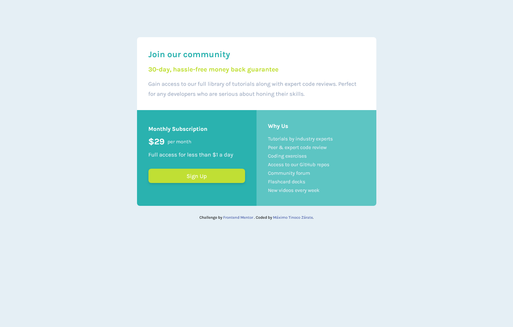

# Frontend Mentor - Single price grid component solution

This is a solution to the [Single price grid component challenge on Frontend Mentor](https://www.frontendmentor.io/challenges/single-price-grid-component-5ce41129d0ff452fec5abbbc). Frontend Mentor challenges help you improve your coding skills by building realistic projects. 

## Overview

### The challenge

Users should be able to:

- View the optimal layout for the component depending on their device's screen size
- See a hover state on desktop for the Sign Up call-to-action

### Screenshot

### Links

- Solution URL: [Add solution URL here]([https://your-solution-url.com](https://github.com/MaximoTz/Single-Price-Grid-Component))
- Live Site URL: [Add live site URL here]([https://your-live-site-url.com](https://grid-single-price-component.netlify.app/))

## My process

### Built with

- Semantic HTML5 markup
- CSS custom properties
- Tailwindcss
- Flexbox
- Mobile-first workflow

**Note: These are just examples. Delete this note and replace the list above with your own choices**

## Author

- Website - [Máximo Tinoco Zárate](https://github.com/MaximoTz/MaximoTz)
- Frontend Mentor - [@MaximoTz](https://www.frontendmentor.io/profile/MaximoTz)

